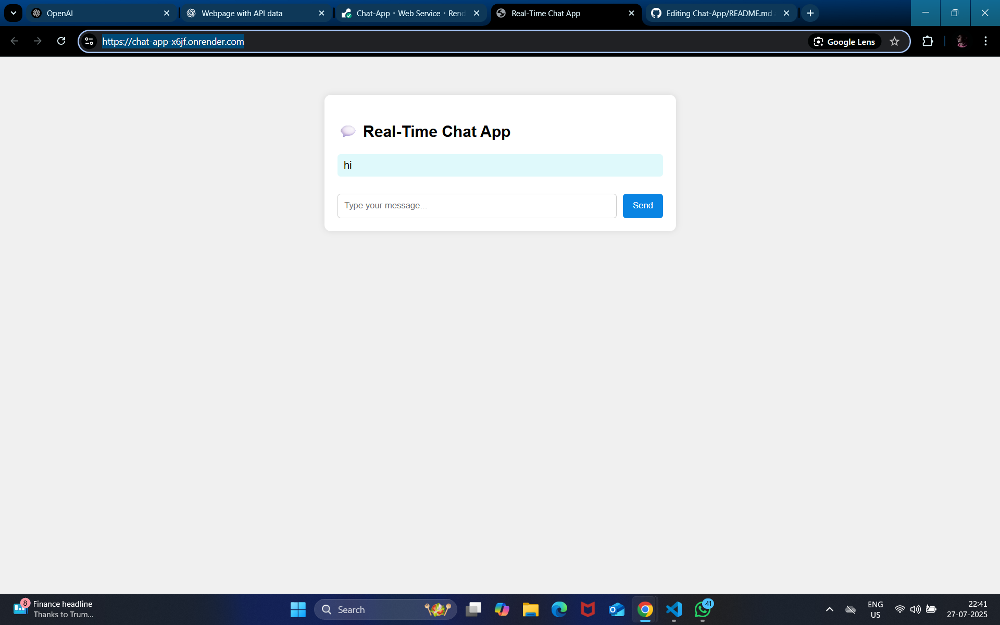

# Chat-App
# 💬 Real-Time Chat Application

This is a real-time chat application built as part of the **CODTECH Internship - Task 2**. It uses **Node.js**, **Express**, and **Socket.IO** to enable live messaging between multiple users.

---
## 👨‍💻 Internship Details
- **Intern Name**: Obulesu Polisetti
- **Intern ID**: CT08DG2167  
- **Internship Program**: Full Stack Web Development Internship  
- **Organization**: [CODTECH Technologies](https://codtech.in)  
- **Task Number**: Task 2
- **Project Title**: Real-Time Chat Application
- **Duration**: 17 June 2025 – 17 August 2025 
---

## 📌 Project Features

- 🔗 Real-time bi-directional communication using WebSockets
- 🖥️ Built with Node.js and Express.js
- 💬 Messages broadcasted to all users instantly
- 🌐 Frontend and backend fully integrated
- 📱 Responsive and clean UI
- 👥 Multi-user support

---

## 🚀 Live Preview

🌍 **Hosted Link**: [View Live App](https://chat-app-x6jf.onrender.com/)


---

## 📸 Preview



---

## 🧑‍💻 Tech Stack

- **Frontend**: HTML, CSS, JavaScript
- **Backend**: Node.js, Express
- **WebSocket**: Socket.IO

---

## 🛠️ Installation and Setup

```bash
# Clone the repository
git clone https://github.com/OBULESH597/chat-app.git
cd chat-app

# Install dependencies
npm install

# Start the server
node server.js

# Open in browser
http://localhost:3000
